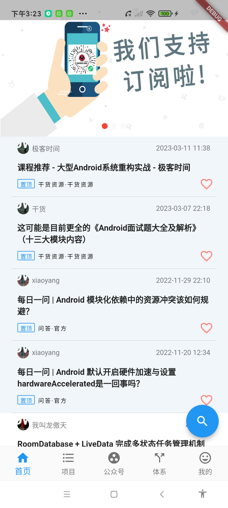
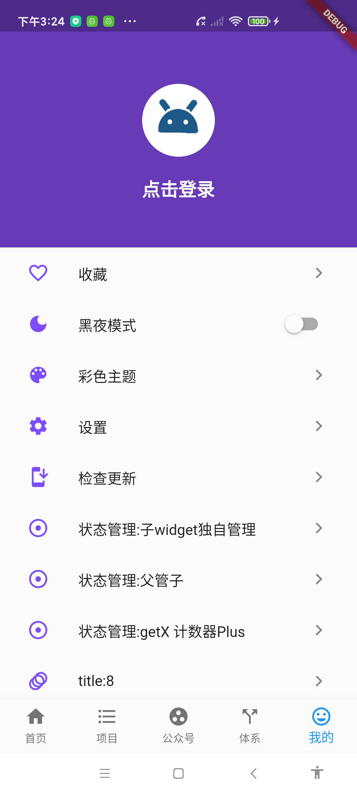
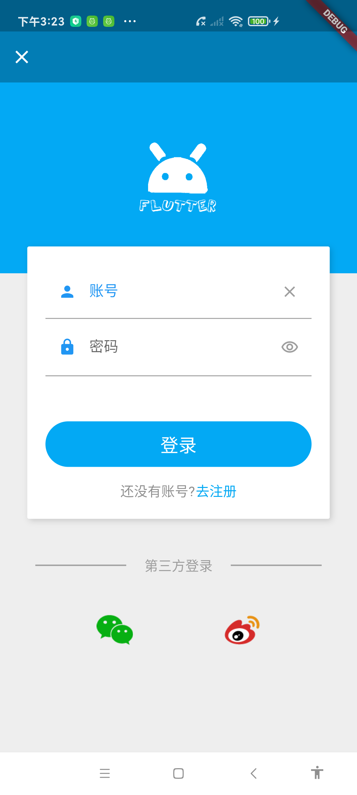

# 介绍

[//]: # 居中无效，有空再试()
<div class="center-images">



</div>

这是我结合「微精通」中提供的学习思路，设计的Flutter学习项目（接口内容由 wanandroid.com 提供，ui参考：）。

整体采用阶梯式的学习路径，分支按照Level1.1 到 Level 2.2 呈阶梯式递增复杂度，每个阶梯在前一个阶梯的基础上开发。
一步步从简到繁方便自己回顾与测试

# 分支说明：

* level1.1:
  * PageView+BottomNavigationBar 搭建app页面框架
  * 完成AccountPage（我的），涉及简单静态列表实现
* level1.2: 完成 LoginPage，涉及组件在容器内的自由摆放
* level1.3:完成HomePage，开发一个信息流页面
* level1.4:ProjectPage
* level2.1:GetX 简单使用
* level2.2: 对Dio网络库进行封装

```dart
// 声明接口
static DataBox<UserinfoModel> login
(String userName, String password) {

var result = NetClient.postForm<UserinfoModel>(WanAndroidApi.login, query: {
  'username': userName,
  'password': password,
});return result.thenObjDataBox
(
(data) => UserinfoModel.fromJson(data));
}
//获取数据
void _login() {
WanAndroidRepository.login(_account, _pwd).offerSuccess((p0) {
Fluttertoast.showToast(msg: "登录成功:${p0.username}");
_userController.loginIn(p0.username ?? "--");
Navigator.of(context).pop("登录成功");
}).offerError((code, msg) => Fluttertoast.showToast(msg: msg));
}
```
